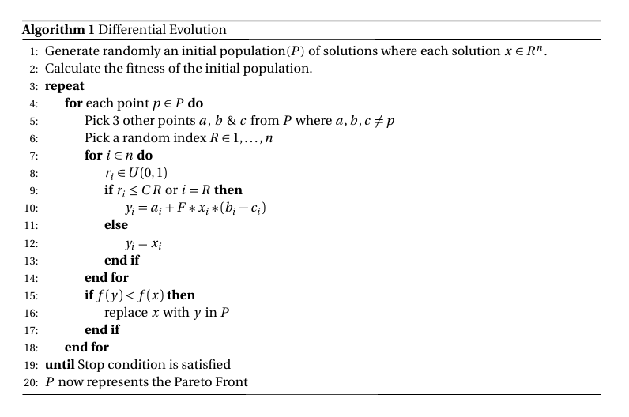

# Dialog Operators in Requirements Engineering.

## Models

There are numerous models modelled as graphs indicating the dependencies between different modules in
requirements engineering. The i* framework[1] proposes an agent-oriented approach to requirements engineering centering on the intentional characteristics of the agent.  Agents attribute intentional properties (such as goals, beliefs, abilities, commitments) to each other and reason about strategic relationships.  Dependencies between agents give rise to opportunities as well as vulnerabilities.  Networks of dependencies are analyzed using a qualitative reasoning approach.  Agents consider alternative configurations of dependencies to assess their strategic positioning in a social context.
The framework is used in contexts in which there are multiple parties (or autonomous units) with strategic interests which may be reinforcing or conflicting in relation to each other.  Examples of such contexts include: business process redesign, business redesign, information systems requirements engineering, analyzing the social embedding of information technology, and the design of agent-based software systems.
The framework consists of nodes and edges with **Tasks** and **Resources** representing input nodes, while **Goals** and **SoftGoals** representing output nodes. Edges are used to propogate values from one node to another. Edges are of four types
* **Dependency** : Parent depends on child. ie If the child is satisfied, then the parent is also satisfied
* **Contribution** : Quantitates softgoals. This edge can be of 4 types: **Make**, **Help**, **Hurt** and **Break**.
* **Decomposition** : Represents logical AND edges.
* **Means-Ends** : Represents logical OR edges.
* 
The figure below highlights the model with an example


In the above figure "Restrict Structure of Password" and "Ask for Secret Question" are identified as unsatisfied and satisfied respectively. These values are propagated through the edges to compute the value of each node. The satisifability of each node is highlighted on it as the values are propogated.


Models are described in the following formats
* Smaller Models in **Py*** graph notation. [Here](https://github.com/dr-bigfatnoob/softgoals/tree/master/src/pystar/models)
* Larger Models in **Py*** graph notation. [Here](https://github.com/dr-bigfatnoob/softgoals/blob/master/src/pystar/models/dot_models.py)
* Larger models in json notation. [Here](https://github.com/dr-bigfatnoob/softgoals/tree/master/src/pystar/json)
* Larger models in graphviz notation. [Here](https://github.com/dr-bigfatnoob/softgoals/tree/master/src/pystar/graphviz)
* .itarml and .ood (No Parser exists)

### Model description using **Py***
 Py* is developed in python where each node/edge is represented as a python class. The class hierachy with each base class followed by their child classes is as follows
 
 ```
 Component
 |.. Node
 |.. |.. Task
 |.. |.. Resource
 |.. |.. Goal
 |.. |.. Softgoal
 |.. Edge
 |.. |.. Dependency
 |.. |.. Decomposition
 |.. |.. |.. AND
 |.. |.. |.. OR
 |.. |.. Contribution
 |.. |.. |.. Make
 |.. |.. |.. Help
 |.. |.. |.. Hurt
 |.. |.. |.. Break
```

The graph is evaluated as follows:
* A node is selected at random from the graph.
* The incoming edges of the node are identified and all the child nodes are recursively evaluated.
* Two kinds of conflicts can arise while evaluating the nodes
  * The incoming edges can be conflicting. For example, one incoming edge can be **help**, while the other can be **hurt**. In such cases a random value(satisfied or unsatisfied) is assigned to the node.
  * A loop can exist. i.e While propagating through the nodes, we notice that the same node is visited again. In such cases too, a random value is assigned to the node.


A sample model shown above is represented as follows

```python
from template import *

N = Many()
# Nodes
n1 = N + SoftGoal(name = "Provide accurate Information", container="Witnesses")
n2 = N + SoftGoal(name = "To know what to do", container="Witnesses")
n3 = N + Task(name = "Follow instructions from firemen", container="Witnesses")
n4 = N + Task(name = "Provide crisis related info", container="Witnesses")
n5 = N + Task(name = "Provide to fireman", container="Witnesses")
n6 = N + Task(name = "Provide info to police", container="Witnesses")
n7 = N + HardGoal(name = "Receive instructions", container="Witnesses")
n8 = N + Resource(name = "Crisis-related information", container="Fire")
n9 = N + Resource(name = "Instructions", container="Fire")
n10 = N + Resource(name = "Instructions", container="Police")
n11 = N + Task(name = "Crisis-related information", container="Police")

E = Many()
#Edges
e1 = E + SomePlus(source = n7,target = n2)
e2 = E + Or(source = n7,target = n3)
e3 = E + And(source = n5,target = n4)
e4 = E + And(source = n6,target = n4)
e5 = E + Dep(source = n5,target = n8)
e6 = E + Dep(source = n9,target = n7)
e7 = E + Dep(source = n10,target = n7)
e8 = E + Dep(source = n6,target = n11)

graph = Graph(name="bCMS_SR_Witness", nodes=N.all, edges=E.all)
```


## Methods

### Optimization

Optimization is performed using differential evolution


### Support Based Ranking

We first rank the decisions usingKruns of the differential evolution algorithm. The Kruns aredivided based on Non Dominated Sorting into

* _best_: Points associated with the top BEST% points.
* _rest_: Points that are not included in best.

The algorithm then computes the probability that a decision is found in _best_ using Bayes Theorem. Informally, the theorem says that _** posterior = prior * likelihood **_ More formally:

```
P(H|E)=P(E|H) * P(H) / P(E)
```

i.e using evidence E and a prior probability P(H) for hypothesis H ∈ {_best_, _rest_}. The theorem calculates the posterior probabilityP(H|E). When applying the theorem, likelihoods are computed from observed frequencies, then normalized to create probabilities (this normalization cancels outP(E)in Eq. 4.2, so it need not becomputed). For example after K=10,000 runs divide into 1,000 lowest 10% _best_ solutions and 9,000 _rest_, the decision X=x might appear 10 times in the best solutions, butonly 5 times in the _rest_. This can be formulated as follows:

```
E = (X=x)
P(best) = 1000/10000 = 0.1
P(rest) = 9000/10000 = 0.9
freq(E|best) = 10/1000 = 0.01
freq(E|rest) = 5/9000 = 0.00056 
like(best|E) = freq(E|best) * P(best) = 0.001
like(rest|E) = freq(E|rest) * P(rest) = 0.00050
P(best|E) = like(best|E) / (like(best|E) + like(rest|E))
P(best|E) * support(best|E) = like(best|E)^2 / (like(best|E) + like(rest|E))
```

### Star1 Algorithm

* **SAMPLE**: To sample the decisions form the models, STAR1 runs the Differential Evolution algorithm K1times.
* **CLASSIFY**: The outcomes of the runs are then ranked into those seen in BEST% as _best_ and the remaining into rest.
* **RANK**: The decisions along with their optimal values are then ranked using Non Dominated Sorting in the decreasing order by their probability * support of appearing in thebest outcomes.
* **PRUNE**: The algorithm then runs K2 experiments with the models where the top ranked decisions between 1...X are pre-set to their optimal value as computed on the previous step. The remaining decisions are assigned random values. This step is crucial as we identify the significance of each decision and its contribution towards the satisfaction of the model's objectives.
* **REPORT**: The algorithm finally plots the median and Inter-Quartile Range(IQR) for each ofthe 1 . . .X decisions which the analyst can use to identify the significance of the decisions.


## Install

1  Setup the dependencies using pip
```
pip install -r requirements.txt
```
2  To run steps for a model
* Preset models in runner.sh
* Set the date and folder name
* Run the following command
```
sh runner.sh
```
3  The output will be saved in ```weekly-reports/<date>/<folder-name>/<model_name>.md```

4  You would need a markdown previewer for viewing the model results.

## References
1. [Horkoff, Jennifer, and Eric Yu. "Evaluating goal achievement in enterprise modeling–an interactive procedure and experiences." IFIP Working Conference on The Practice of Enterprise Modeling. Springer Berlin Heidelberg, 2009.](http://www.cs.toronto.edu/pub/eric/PoEM09-JH.pdf)
